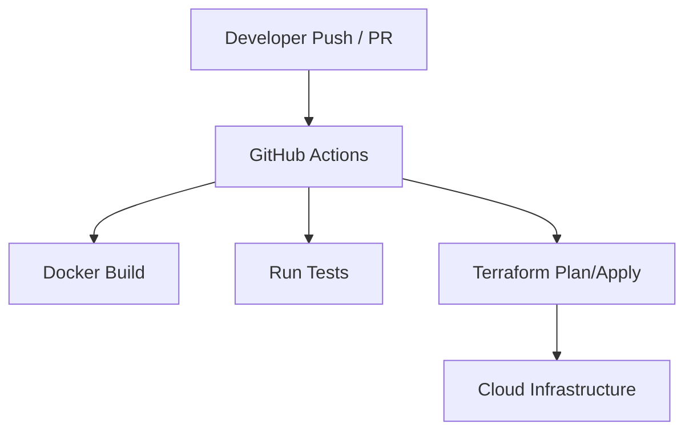

# Calebsons DevOps Infrastructure — CI/CD Pipeline

## Overview

A production-ready CI/CD pipeline using GitHub Actions, Docker, and Terraform.

## Tech Stack

- GitHub Actions
- Docker
- Terraform
- Bash

## Features

- Automated builds
- Multi-stage Docker builds
- Infrastructure as Code
- Test automation

## Architecture

## Setup

- Configure secrets in GitHub
- Run Terraform init/apply

## Deployment

- GitHub Actions

## Roadmap

- Add canary deployments
- Add security scanning
